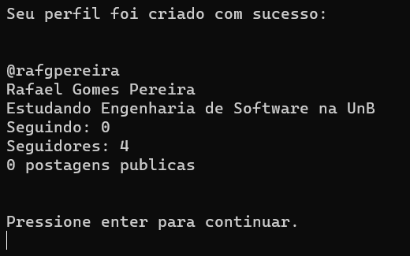
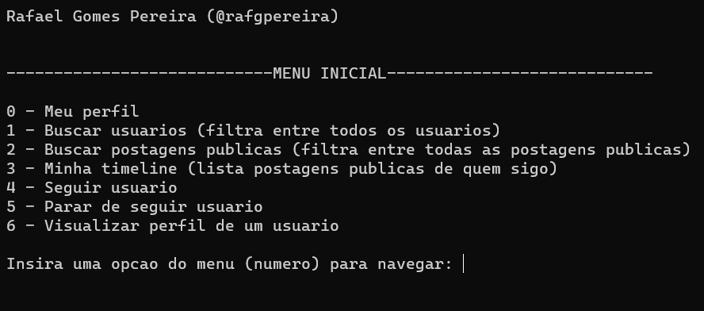
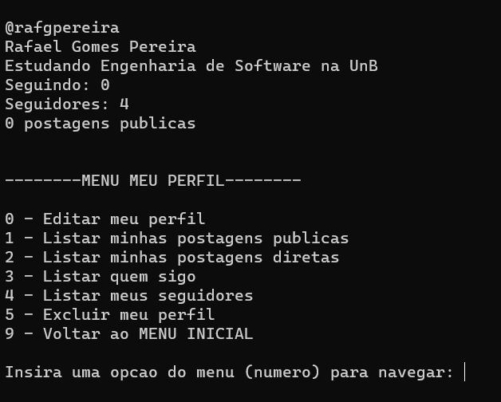
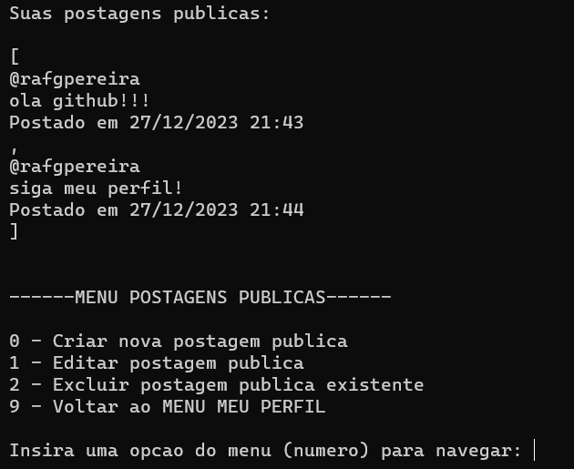
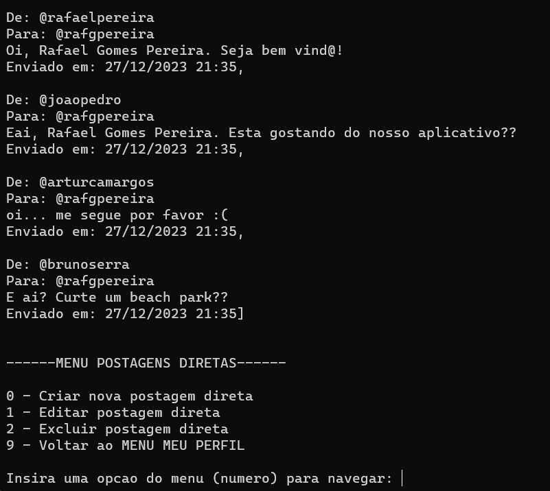
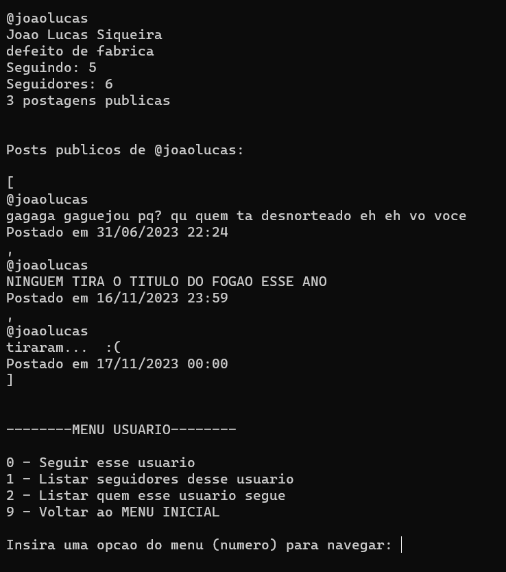
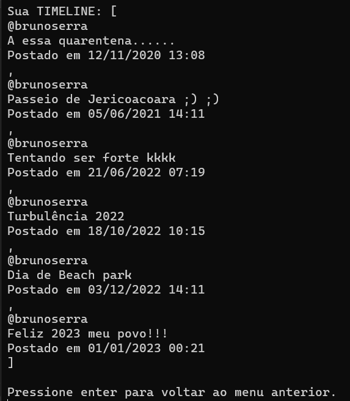
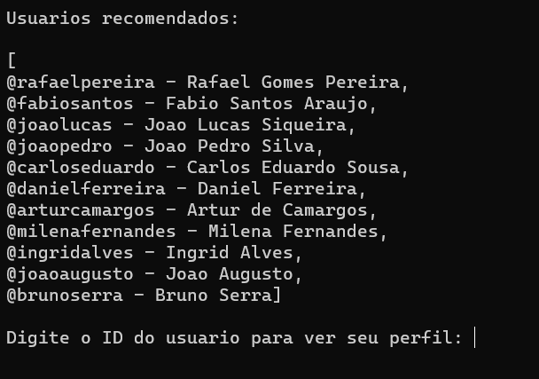

# SISTEMA TWITTER

## Sobre

Este é um sistema que implementa funcionalidades do Twitter, através dos conceitos de programação orientada a objetos.

O software é executado em terminal, e possui as seguintes funcionalidades:

- CRUD de conta, postagens publicas e mensagens privadas
- Timeline
- Lógica de follow e unfollow
- Buscas, filtros e listagens de usuários e postagens

## Conteúdos Aplicados:

### Java

- Lógica de programação (estrutura sequencial, condicional e repetitiva, vetores, funções)
- Entrada e saída de dados
- Tipos e tratamento de dados
- Programação orientada a objetos

### Orientação a objetos

- Classe, objeto, atributos e métodos
- Construtores
- Sobrecarga
- Encapsulamento
- Membros estáticos
- Sobrescrita
- Composição de classes
- Associação/dependência de classes
- Classes abstratas
- Herança
- Polimorfismo

## Diagrama de Classes - UML

O diagrama de classes apresenta de forma simplificada as classes, suas propriedades (atributos e métodos) e seus relacionamentos:

## Demonstração

### Perfil Criado

Visualização do perfil criado pelo usuário.

### Menu Inicial

O menu inicial oferece as principais opções do aplicativo.

### Menu Meu Perfil

O menu meu perfil oferece opções a cerca do perfil individual do usuário.

### Menu Postagens Públicas

As postagens públicas do usuário são listadas e o menu com as opções é exibido.

### Menu Postagens Diretas

As postagens diretas enviadas e recebidas são listadas e o menu com as opções é exibido.

### Perfis Usuários

Visualização do perfil dos outros usuários da aplicação.

### Timeline

Listagem das postagens públicas dos usuários seguidos.

### Buscar Usuários

Painel de busca por usuários da plataforma.

## Como usar

### Requisitos

- Ter uma versão recente do Java instalada (recomenda-se a LTS)
- Ter o JDK instalado

### Executando

- Clone o repositório
- Identifique a pasta com os arquivos executáveis do projeto
- Abra essa pasta no terminal
- Execute a classe Main do pacote main (java main.Main)
- 
